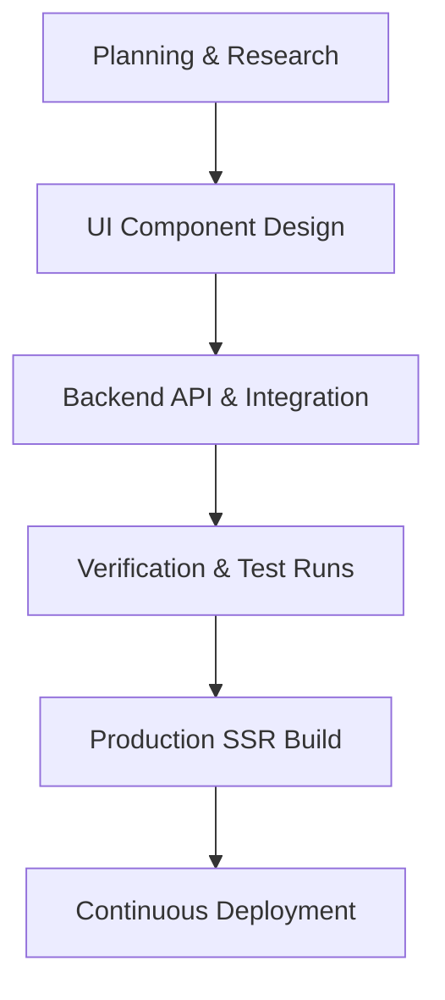

# Software Development Life Cycle (SDLC) — DeliverIQ

This document outlines the Software Development Life Cycle (SDLC) processes, coding conventions, quality gates, and deployment flows for the **DeliverIQ** platform. 

---

## 1. Development Methodology
DeliverIQ follows an **Iterative Agile Methodology** with continuous feature increments. Because the project supports AI-assisted development (equipped with dev-tools and component source-mapping), changes are rapidly proposed, refined, and verified in isolated branch workspaces before merging.

---

## 2. Key Lifecycle Phases

### Phase 1: Planning and Research
- **Input**: User stories, Figma UI designs, or new session requirements.
- **Tasks**: Determine new layout requirements, payment flows, or content schemas.
- **Output**: Detailed task tickets and implementation plans written to `implementation_plan.md`.

### Phase 2: Design & UI Component Scaffolding
- **UI System**: Built with modern Tailwind CSS and Radix UI primitives (`shadcn/ui`).
- **Principles**: Keep components small, functional, and typed. Make sure they use design tokens defined in `src/styles/globals.css` and `tailwind.config.js`.
- **Introspection**: All components are compiled with `source-mapperPlugin` in dev mode to support click-to-edit and AI element mapping.

### Phase 3: Backend API & Payment Integration
- **Framework**: Node.js v22+ running an Express server.
- **Core Integrations**:
  - **Stripe**: Handlers for checkout sessions (`/api/stripe/checkout`) and webhook verification (`/api/stripe/webhook`).
  - **Transactional Mail**: Communicates via loopback gateway (`127.0.0.1:2525`) for reliable SMTP delivery.

### Phase 4: Verification (Testing & Linting)
- Before code is merged:
  - **Type Checking**: Run `npm run type-check` to verify TypeScript compiler correctness.
  - **Linting**: Run `npm run lint` to enforce formatting and prevent security risks (e.g., using `eslint-plugin-security`).
  - **Unit Testing**: Run `npm run test` using **Vitest** to run unit and integration tests.

### Phase 5: Production Build and SSR Verification
- **SSR Compilation**: DeliverIQ compiles both a client bundle and an Express SSR bundle (`vite build && vite build --ssr src/server/entry.ts`).
- **Asset Optimization**: Static assets under `/assets/` are marked as public, immutable, and cached for 1 year.
- **Fail-Safe Checks**: In production boot, the server checks for template injection markers (`<!--app-head-->` and `<!--app-html-->`). If missing, it fails fast (`process.exit(1)`) to avoid deploying un-indexable shells.

### Phase 6: Deployment & Monitoring
- **Hosting**: Containerized deployment (e.g., Docker, Railway, or Render) to host the Express SSR server.
- **Observability**: SSR failures, Express route errors, and email gateway failures are logged via `console.error` at production levels to hook into monitoring dashboards.

---

## 3. Pull Request & Quality Gates

| Gate / Check | Command | Description | Severity |
| :--- | :--- | :--- | :--- |
| **Linter** | `npm run lint` | ESLint checks, security alerts, and React Hook rules. | Blocking |
| **Formatter** | `npm run format` | Prettier formats `.ts`, `.tsx`, `.json`, and `.md` files. | Warn |
| **Compiler** | `npm run type-check` | TypeScript compiler runs in non-emitting mode (`tsc --noEmit`). | Blocking |
| **Unit Tests** | `npm run test` | Executes Vitest runner on component/helper specs. | Blocking |
| **Build Test** | `npm run build` | Builds client assets and backend SSR entry. | Blocking |

---

## 4. Release & Deployment Pipeline
1. **Branch Out**: Create feature branch from `main`.
2. **Implement**: Code the changes, updating components or server endpoints.
3. **Verify Locally**: Run local dev environment via `npm run dev` and test runner via `npm run test`.
4. **Compile production build**: Run `npm run build` to verify webpack/vite output compiles cleanly.
5. **Merge & Deploy**: Merging to `main` triggers auto-deployment to staging or production, which boots the Node v22 environment and starts the Express server listening on the designated `PORT`.
