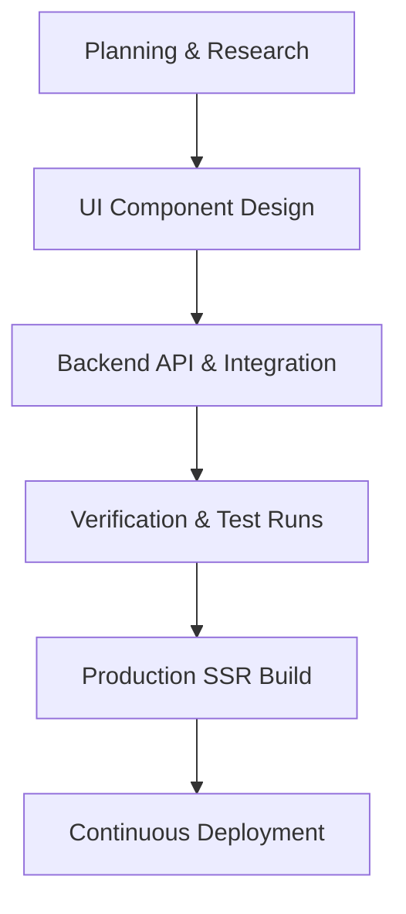

# Software Development Life Cycle (SDLC) — DeliverIQ

This document outlines the Software Development Life Cycle (SDLC) processes, coding conventions, quality gates, and deployment flows for the **DeliverIQ** platform. 

---

## 1. Development Methodology
DeliverIQ follows an **Iterative Agile Methodology** with continuous feature increments. Because the project supports AI-assisted development (equipped with dev-tools and component source-mapping), changes are rapidly proposed, refined, and verified in isolated branch workspaces before merging.

---

## 2. Key Lifecycle Phases

### Phase 1: Planning and Research
- **Input**: User stories, Figma UI designs, or new session requirements.
- **Tasks**: Determine new layout requirements, payment flows, or content schemas.
- **Output**: Detailed task tickets and implementation plans written to `implementation_plan.md`.

### Phase 2: Design & UI Component Scaffolding
- **UI System**: Built with modern Tailwind CSS and Radix UI primitives (`shadcn/ui`).
- **Principles**: Keep components small, functional, and typed. Make sure they use design tokens defined in `src/styles/globals.css` and `tailwind.config.js`.
- **Introspection**: All components are compiled with `source-mapperPlugin` in dev mode to support click-to-edit and AI element mapping.

### Phase 3: Backend API, Storage & Payment Integration
- **Framework**: Node.js v22+ running an Express server with 50MB payload limits (`express.json({ limit: '50mb' })`).
- **Database & Storage**: **Supabase** (managed PostgreSQL & S3 Object Storage):
  - Database access via anon client on frontend (`VITE_SUPABASE_URL` / `VITE_SUPABASE_ANON_KEY`) and service role key on server (`SUPABASE_SERVICE_ROLE_KEY`).
  - Storage bucket `deliveriq-assets` stores public user and speaker avatars uploaded via `/api/cms/upload`.
  - Database sync script (`sync-cms.ts`) updates server and database CMS layout strings seamlessly.
- **Core Integrations**:
  - **Stripe**: Handlers for checkout sessions (`/api/stripe/checkout`) and webhook verification (`/api/stripe/webhook`).
  - **Razorpay**: Payment processing via Razorpay API (`RAZORPAY_KEY_ID` / `RAZORPAY_KEY_SECRET`) with a client-side checkout widget (`VITE_RAZORPAY_KEY_ID`).
  - **Supabase Auth & Data**: User authentication and real-time database operations via the Supabase JS client. Array deletion reconciliation strategy guarantees database deletes are executed synchronously.
  - **Transactional Mail**: Communicates via loopback gateway (`127.0.0.1:2525`) for reliable SMTP delivery.

### Phase 4: Verification (Testing & Linting)
- Before code is merged:
  - **Type Checking**: Run `npm run type-check` to verify TypeScript compiler correctness.
  - **Linting**: Run `npm run lint` to enforce formatting and prevent security risks (e.g., using `eslint-plugin-security`).
  - **Unit Testing**: Run `npm run test` using **Vitest** to run unit and integration tests. Test files follow the `*.test.ts` / `*.test.tsx` naming convention and are co-located with the source files they test.

### Phase 5: Production Build and SSR Verification
- **Build Command**: `npm run build` executes a two-stage Vite build:
  1. **Client Build** — Bundles the React SPA into `dist/` with hashed static assets.
  2. **SSR Build** — Compiles the Express server entry (`vite build --ssr src/server/entry.ts`) into the `api/` directory.
  3. **Shell Copy** — The build script copies `dist/index.html` to `api/shell.html` for the SSR renderer to use as a template.
- **Asset Optimization**: Static assets under `/assets/` are marked as public, immutable, and cached for 1 year.
- **Fail-Safe Checks**: In production boot, the server checks for template injection markers (`<!--app-head-->` and `<!--app-html-->`). If missing, it fails fast (`process.exit(1)`) to avoid deploying un-indexable shells.

### Phase 6: Deployment & Monitoring
- **Vercel Serverless**: The primary deployment target is **Vercel**. When `process.env.VERCEL` is set, the Express server skips `app.listen()` and instead exports the Express app as a serverless function handler. The `VERCEL_OIDC_TOKEN` environment variable is automatically injected by the Vercel platform.
- **Containerized Fallback**: For non-Vercel environments, the app can be deployed as a containerized Express SSR server (e.g., Docker, Railway, or Render) where `app.listen(PORT)` starts the server normally.
- **Observability**: SSR failures, Express route errors, and email gateway failures are logged via `console.error` at production levels to hook into monitoring dashboards.

---

## 3. Pull Request & Quality Gates

| Gate / Check | Command | Description | Severity |
| :--- | :--- | :--- | :--- |
| **Linter** | `npm run lint` | ESLint checks, security alerts, and React Hook rules. | Blocking |
| **Formatter** | `npm run format` | Prettier formats `.ts`, `.tsx`, `.json`, and `.md` files. | Warn |
| **Compiler** | `npm run type-check` | TypeScript compiler runs in non-emitting mode (`tsc --noEmit`). | Blocking |
| **Unit Tests** | `npm run test` | Executes Vitest runner on `*.test.ts` / `*.test.tsx` specs. | Blocking |
| **Build Test** | `npm run build` | Builds client assets and backend SSR entry into `dist/` and `api/`. | Blocking |

---

## 4. Release & Deployment Pipeline
1. **Branch Out**: Create feature branch from `main`.
2. **Implement**: Code the changes, updating components or server endpoints.
3. **Verify Locally**: Run local dev environment via `npm run dev` and test runner via `npm run test`.
4. **Compile production build**: Run `npm run build` to verify Vite output compiles cleanly (client → `dist/`, SSR → `api/`).
5. **Merge & Deploy**: Merging to `main` triggers auto-deployment:
   - **Vercel**: Builds and deploys as serverless functions automatically. The Express app is exported as a handler (no `app.listen()`).
   - **Containerized**: Boots the Node v22 environment and starts the Express server listening on the designated `PORT`.

---

*Last updated: 2026-08-03*
